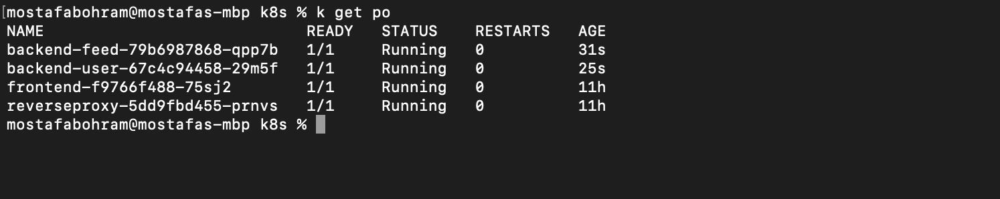
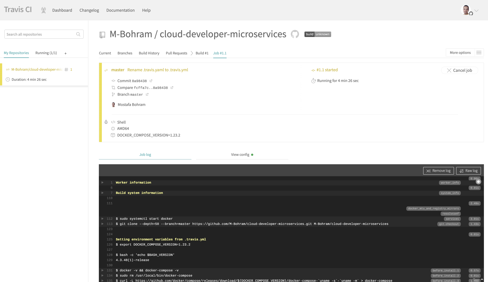
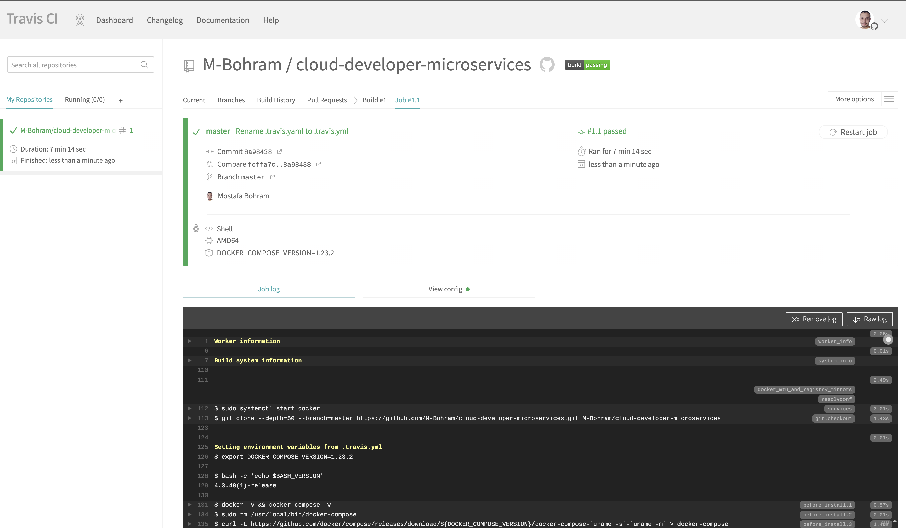
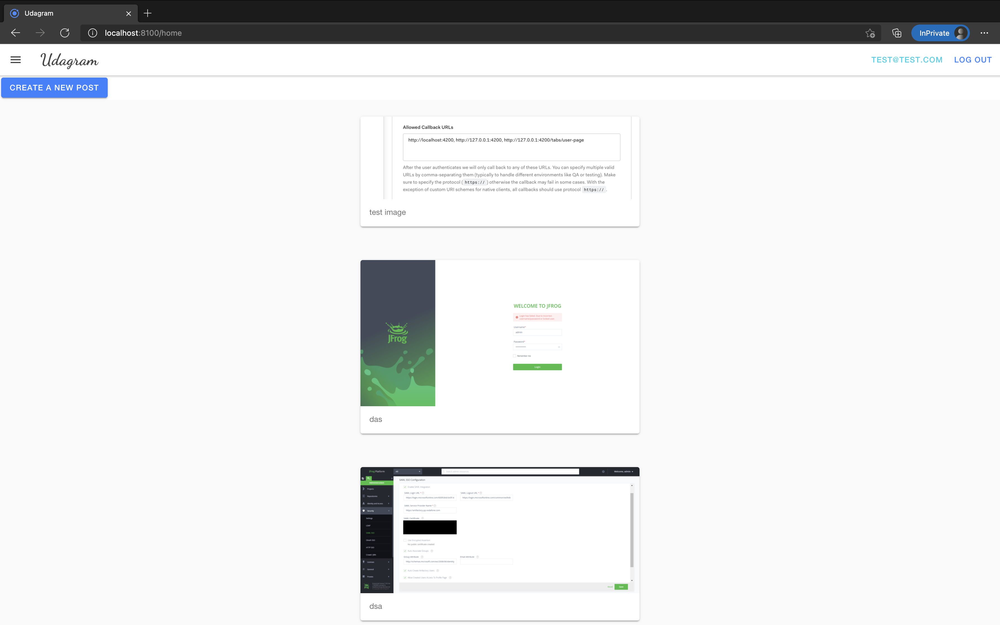

# Udagram Cloud Developper Nanodegre Project #3

This project is the submission of udacity cloud developer nanodegree

## About the App
Udagram is a simple cloud application developed alongside the Udacity Cloud Engineering Nanodegree. It allows users to register and log into a web client, post photos to the feed, and process photos using an image filtering microservice.

## Docker hub images
1. [Frontend](https://hub.docker.com/r/mbohram/udagram-frontend). 
2. [RestAPI Feed Backend](https://hub.docker.com/r/mbohram/udagram-backend-feed)
3. [RestAPI User Backend](https://hub.docker.com/r/mbohram/udagram-backend-user)
4. [ReverseProxy](https://hub.docker.com/r/mbohram/udagram-reverseproxy)


## Getting Setup

### clone this repository
clone this repository locally
```bash
git clone https://github.com/M-Bohram/cloud-developer-microservices.git
```

***

### Docker compose
To run and deploy this project with Docker, make sure to have [Docker compose](https://github.com/docker/compose) on your system. Open a new terminal within the project directory and run:
1. cd into the docker diretory: `cd udacity-c3-deployment/docker/`
2. start the container: `docker-compose up`
>_tip_: when the project is running, you can view it in your browser at `localhost:8100` for the frontend and `localhost:8080` for the reverse proxy exposing the rest api
3. stop the containers: `docker-compose down`

docker-compose up --build -d screenshot


***

### Kubernetes
To run commands against your Kubernetes clusters, install and setup [kubectl](https://kubernetes.io/docs/tasks/tools/install-kubectl/). Open a new terminal within the project directory and run:
1. cd into the kubernetes diretory: `cd udacity-c3-deployment/k8s/`
2. add your secret and configmap
>_tip_: Add your  base64 secret in  `env-secret.yaml`, your AWS credentials in `aws-secret.yaml` and your configMap in `env-configmaps.yaml`. and use `kubectl apply -f env-secret.yaml,aws-secret.yaml,env-configmaps.yaml`
3. Create your deployements and services: `kubectl apply -f reverseproxy-deployment.yaml,reverseproxy-service.yaml,frontend-deployment.yaml,frontend-service.yaml,backend-feed-deployment.yaml,backend-feed-service.yaml,backend-user-deployment.yaml,backend-user-service.yaml`
4. To see all running containers run `kubectl get pod`
>_tip_: to run your cluster locally, port-forward the frontend service `kubectl port-forward service/frontend 8100:8100` and the reverseproxy service `kubectl port-forward service/reverseroxy 8080:8080`, you can view it in your browser at `localhost:8100` for the frontend and `localhost:8080` for the reverse proxy exposing the rest api
5. to deploy a new version of the feed microservice run `kubectl apply -f backend-feed-deployment.yaml,backend-feed-service.yaml`

kubectl get pod screenshot


Note: I created one pod for each deployment as I am testing on my local machine with limited resources (RAM & CPU)
***

### Travis
This project use Travis CI to build the application.
CI screenshot



***

### App screenshot
CI screenshot



***

#### Acknoledgements
I got inspiration of this documentation from [mowamed](https://github.com/mowamed/cloud-developer-microservices/), thanks to him ❤️